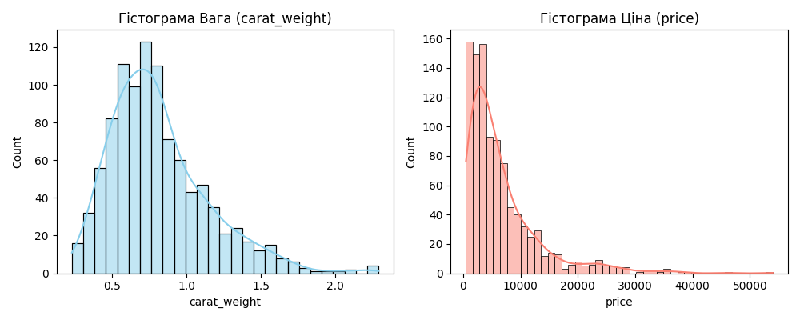
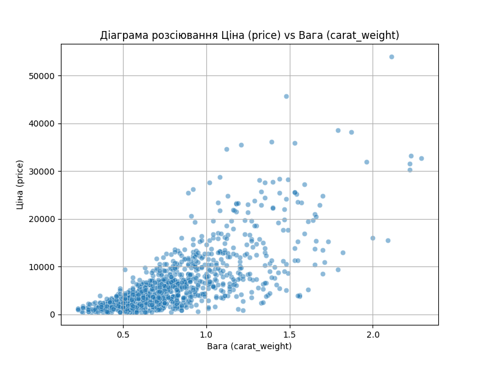

# Звіт з Самостійної роботи №1: Кореляційний аналіз

**Дата:** 2025-11-13 14:36

**Предметна область:** Ідентифікація діамантів (diamonds_dataset.csv)
**Мета:** Визначити тип та тісноту взаємозв’язку між змінними `Вага (carat_weight)` та `Ціна (price)`.

---

## 1. Аналіз розподілу даних

**Перевірка на нормальність (Тест Шапіро-Уілка):**
* `Вага (carat_weight)`: p-value = 1.8834e-20
* `Ціна (price)`: p-value = 1.6391e-35

**Висновок:** Принаймні одна зі змінних не розподілена нормально (p < 0.05).

## 2. Аналіз кореляційного зв'язку

**Результати розрахунку:**

- **Обраний метод:** Спірмен (оскільки дані не є нормальними).
- **Коефіцієнт кореляції (r):** `0.7428`
- **p-value:** `4.2492e-176`

## 3. Загальний висновок

Між `Вага (carat_weight)` та `Ціна (price)` існує **сильний прямий зв’язок**.

Зв'язок є статистично значущим (p < 0.001), що дозволяє відхилити нульову гіпотезу про відсутність кореляції. Це підтверджує нашу закладену в генератор логіку, що ціна діаманта сильно залежить від його ваги.
