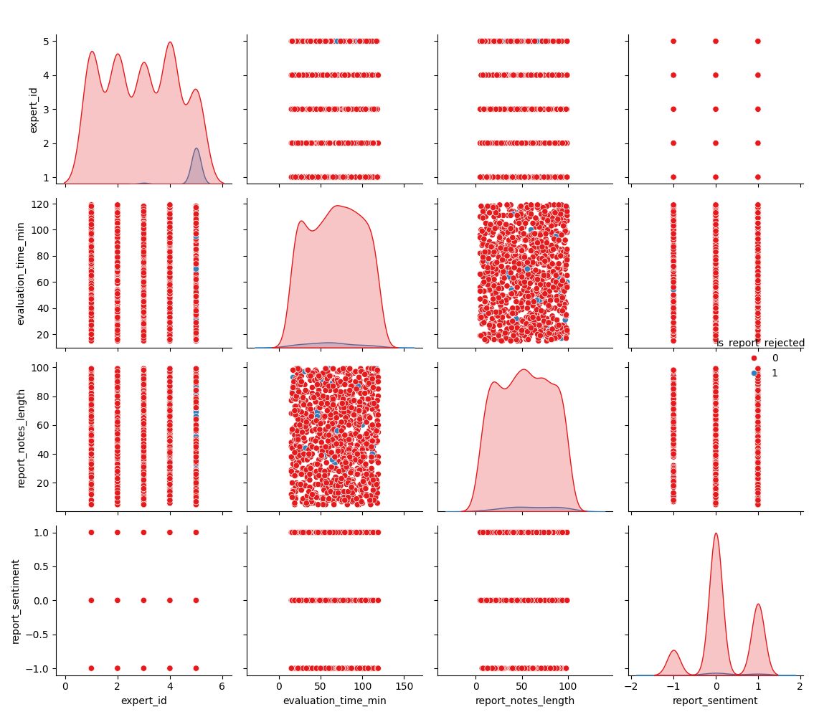

# Звіт з Самостійної роботи №2: Інтелектуальна задача (Агент)

**Дата:** 2025-11-13 20:08

**Предметна область:** Ідентифікація діамантів (diamonds_dataset.csv)
**Мета:** Розробити агента, що прогнозує `is_report_rejected` та моделює дії для зниження % відхилень.

---

## 1. Аналіз поточного стану

**Початковий % відхилень (Rejection Rate):** `3.10%`

Для аналізу було обрано **4** ознаки: `expert_id, evaluation_time_min, report_notes_length, report_sentiment`.

## 2. Результати навчання 'мозку' агента (LDA/QDA)

Агент був навчений на двох моделях для прогнозування `is_report_rejected`.

- **Модель LDA (Linear):** точність `0.7470`
- **Модель QDA (Quadratic):** точність `0.8190`

Для подальшого сценарного моделювання було обрано модель **LDA** як більш стабільну.
(Детальні метрики, вкл. Confusion Matrix, збережено у `02_agent_results.txt`)

## 3. Сценарне моделювання 'Що-Якщо'

Агент протестував 3 можливі управлінські дії для досягнення цілі (< 2.0% відхилень):

| Дія (Action) | Прогнозований % відхилень |
| :--- | :--- |
| `retrain_expert_5` | **10.50%** |
| `enforce_time_policy` | **28.20%** |
| `implement_checklists` | **29.40%** |

## 4. Висновок

Побудований інтелектуальний агент успішно проаналізував поточний стан та змоделював наслідки своїх дій.

Аналіз показав, що **найбільш ефективною дією** є `retrain_expert_5` та `enforce_time_policy`, оскільки саме ці фактори були закладені в набір даних як основні причини помилок. Це демонструє здатність агента знаходити оптимальний шлях до досягнення мети.
