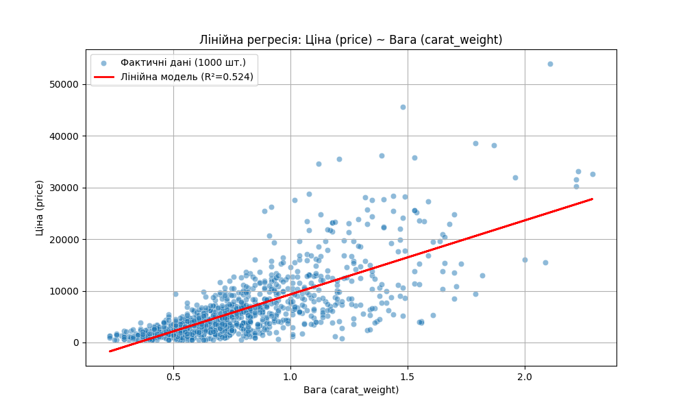

# Звіт з Самостійної роботи №2: Лінійний регресійний аналіз

**Дата:** 2025-11-13 17:17

**Предметна область:** Ідентифікація діамантів (diamonds_dataset.csv)
**Мета:** Навчитись будувати лінійну регресійну модель між залежною (`Ціна (price)`) та незалежною (`Вага (carat_weight)`) змінними.

---

## 1. Результати моделювання

Побудовано лінійну регресійну модель за методом найменших квадратів (OLS).

- **Залежна змінна (Y):** Ціна (price)
- **Незалежна змінна (X):** Вага (carat_weight)
- **Отримане рівняння регресії:** `Y = 14319.36 * X + -5019.34`
- **Коефіцієнт детермінації ($R^2$):** `0.5237`

## 2. Візуалізація моделі

## 3. Висновок

Коефіцієнт детермінації $R^2$ показує, що побудована лінійна модель пояснює приблизно **52.4%** варіації у ціні діаманта.

Як видно з графіка, лінійна модель лише частково описує зв'язок. Дані мають чітко виражений **нелінійний (експоненціальний)** характер: ціна зростає набагато швидше, ніж вага. Ця модель є **базовою (baseline)** і буде використана для порівняння з більш складними нелінійними моделями в Cамостійній роботі №3.
