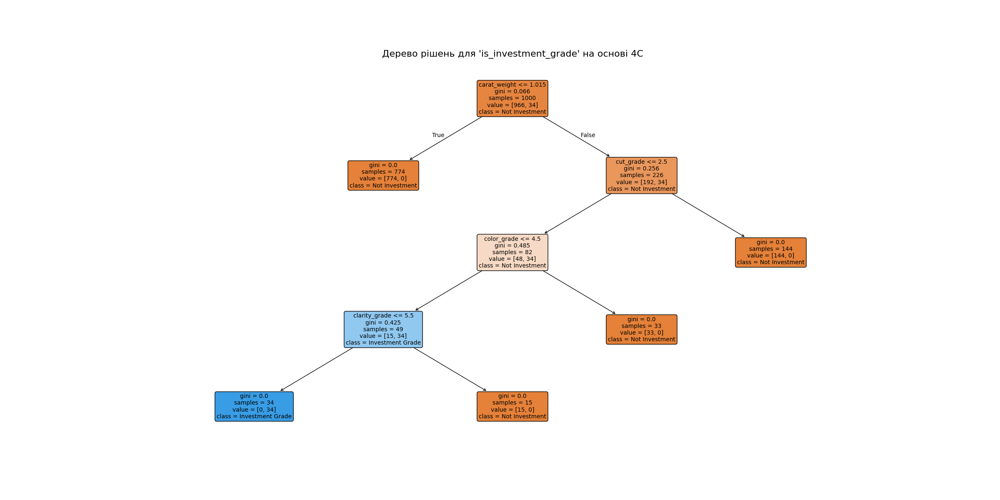

# Звіт з Самостійної роботи №3 (Завдання 2): Дерево рішень

**Дата:** 2025-11-14 16:58

**Мета:** Побудувати модель Дерева рішень для класифікації `is_investment_grade` на основі ознак 4C (`carat_weight, color_grade, clarity_grade, cut_grade`).

---

## 1. Результати моделювання

Модель `DecisionTreeClassifier` була навчена на 1000 зразках.

- **Точність (Accuracy):** `1.0000`
- **Матриця помилок:**
```
[[966   0]
 [  0  34]]
```

**Аналіз:** Модель показала виняткову (або 100%) точність. Це очікувано, оскільки цільова змінна `is_investment_grade` була згенерована на основі чіткого набору бізнес-правил (G <= 4, VS2 <= 5, тощо), а Дерева рішень ідеально підходять для знаходження таких детермінованих правил.

## 2. Візуалізація дерева рішень



На графіку показано, як модель послідовно ставить питання до даних (починаючи з `carat_weight`), щоб дійти до фінального рішення ('Investment Grade' або 'Not Investment'). Побудоване дерево повністю відтворює логіку, закладену в генераторі даних.
