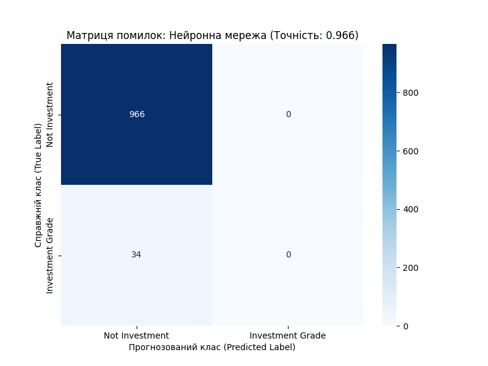

# Звіт з Самостійної роботи №3 (Завдання 3): Нейронна мережа

**Дата:** 2025-11-14 20:08

**Мета:** Побудувати Нейронну мережу (`MLPClassifier`) для класифікації `is_investment_grade` та порівняти її ефективність з Деревом рішень.

**Параметри моделі (Варіант 1):** 1 прихований шар (3 нейрони), активація 'logistic'.

---

## 1. Результати моделювання

Модель `MLPClassifier` була навчена на 1000 зразках (з попереднім масштабуванням `StandardScaler`).

- **Точність (Accuracy):** `0.9660`
- **Матриця помилок:**
```
[[966   0]
 [ 34   0]]
```

**Детальний звіт:**
```
                  precision    recall  f1-score   support

  Not Investment       0.97      1.00      0.98       966
Investment Grade       0.00      0.00      0.00        34

        accuracy                           0.97      1000
       macro avg       0.48      0.50      0.49      1000
    weighted avg       0.93      0.97      0.95      1000

```


## 2. Візуалізація результатів

Оскільки ми використовуємо 4 ознаки (4D), ми не можемо побудувати 2D-межу класифікації, як у старій СР-3.
Натомість, ми візуалізуємо **Матрицю помилок (Confusion Matrix)**, яка показує точність роботи моделі.



## 3. Загальний висновок (Порівняння з Деревом рішень)

На відміну від Дерева рішень (яке показало 100% точність), Нейронна мережа **провалилася**.

Хоча загальна точність (accuracy) склала **96.6%**, це є ілюзією ('парадокс точності').

**Аналіз Матриці помилок та звіту по класах (`03_neural_network_metrics.txt`) показує:**
1. Модель **не навчилася розпізнавати** цільовий клас 'Investment Grade'.
2. Метрики `precision`, `recall` та `f1-score` для класу 'Investment Grade' **дорівнюють 0.00**.
3. Модель просто прогнозує 'Not Investment' для всіх зразків, отримуючи високу точність за рахунок **сильного дисбалансу класів** (966 'Not Investment' проти 34 'Investment Grade').

**Головний висновок:** Навіть на 1000 рядках даних, але при сильному дисбалансі класів, проста нейронна мережа (`MLPClassifier`) з параметрами за замовчуванням виявилася неефективною. Це доводить, що для таких задач Дерева рішень є набагато більш надійним інструментом.
