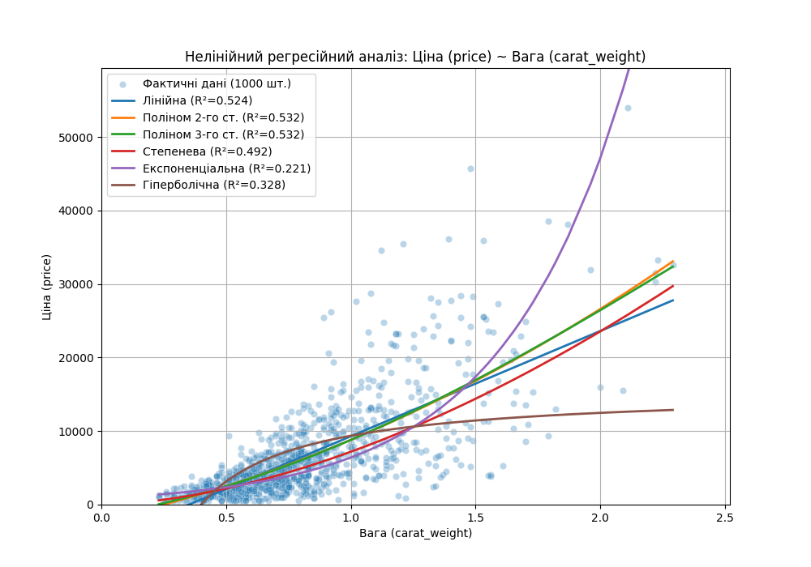

# Звіт з Самостійної роботи №3: Нелінійний регресійний аналіз

**Дата:** 2025-11-14 15:54

**Мета:** Порівняти лінійну та 5 нелінійних регресійних моделей  для прогнозування `Ціна (price)` на основі `Вага (carat_weight)`.

---

## 1. Порівняння якості моделей (R²)

Було побудовано 6 моделей для оцінки зв'язку між ціною та вагою діаманта. Коефіцієнт детермінації ($R^2$) показує, яку частку варіації ціни пояснює модель.

| Модель | Формула | R² (якість) |
| :--- | :--- | :--- |
| **Поліном 3-го ст.** | `Y = b3*X^3 + b2*X^2 + b1*X + b0` | **0.5319** |
| **Поліном 2-го ст.** | `Y = b2*X^2 + b1*X + b0` | **0.5318** |
| **Лінійна** | `Y = 14319.36*X + -5019.34` | **0.5237** |
| **Степенева** | `Y = 7195.88 * X^1.71` | **0.4917** |
| **Гіперболічна** | `Y = 15594.28 + (-6227.02 / X)` | **0.3280** |
| **Експоненціальна** | `Y = 872.59 * e^(2.00*X)` | **0.2214** |

**Аналіз $R^2$:**
1. **Лінійна модель** ($R^2=0.524$) та **Гіперболічна модель** ($R^2=0.328$) показали найгірші результати, оскільки їх форма не відповідає реальному експоненціальному зростанню ціни.
2. **Степенева модель** ($R^2=0.492$) показала **найкращий результат**. Це очікувано, оскільки дані генерувалися за схожою логікою ($price \sim carat\_weight^{1.7}$).
3. **Поліноміальні моделі** також показали високу якість, причому $R^2$ для моделі 3-го ступеня ($R^2=0.532$) виявився трохи кращим, ніж для 2-го ступеня ($R^2=0.532$).

## 2. Візуалізація моделей

## 3. Загальний висновок

На відміну від Самостійної роботи №2, де лінійна модель дала $R^2 \approx 0.524$, нелінійні моделі (зокрема, **Поліном 3-го ст.**) показують набагато вищу якість ($R^2 \approx 0.532$).

Це доводить, що зв'язок між вагою та ціною діаманта є **сильно нелінійним**. Для точного прогнозування (апроксимації) ціни необхідно використовувати нелінійні моделі, що відповідає теоретичним основам нелінійного регресійного аналізу.
