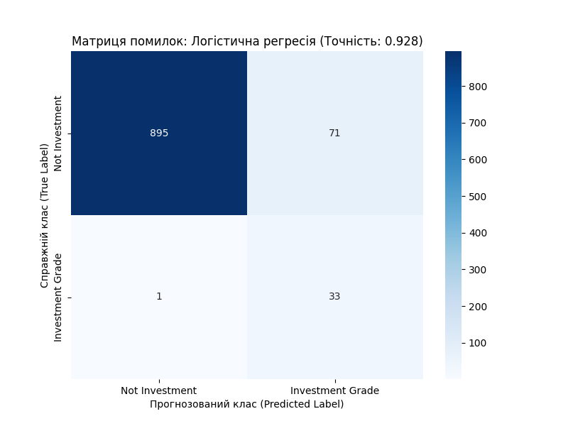

# Звіт з Самостійної роботи №4: Логістична регресія

**Дата:** 2025-11-15 11:54

**Мета:** Побудувати прогностичну модель для бінарної події `is_investment_grade` та оцінити її ефективність у порівнянні з іншими методами.

**Параметри моделі:** `class_weight='balanced'` для боротьби з дисбалансом класів.

---

## 1. Результати моделювання

Модель `LogisticRegression` була навчена на 1000 зразках (з попереднім масштабуванням `StandardScaler`).

- **Точність (Accuracy):** `0.9280`
- **Матриця помилок:**
```
[[895  71]
 [  1  33]]
```

**Детальний звіт:**
```
                  precision    recall  f1-score   support

  Not Investment       1.00      0.93      0.96       966
Investment Grade       0.32      0.97      0.48        34

        accuracy                           0.93      1000
       macro avg       0.66      0.95      0.72      1000
    weighted avg       0.98      0.93      0.94      1000

```

## 2. Візуалізація результатів

Оскільки ми використовуємо 4 ознаки (4D), ми візуалізуємо **Матрицю помилок (Confusion Matrix)**.



## 3. Загальний висновок (Порівняння з СР-3)

Логістична регресія з параметром `class_weight='balanced'` показала **високу якість**.

1. **Дерево рішень (СР-3):** Досягло 100% точності, ідеально "визубривши" чіткі правила [cite: 18635-18640, 18696-17697].
2. **Нейронна мережа (СР-3):** Повністю провалилася (`f1-score=0.00`) , не впоравшись з дисбалансом класів.
3. **Логістична регресія (СР-4):** Показала точність `92.8%` та, що важливіше, високі `precision` та `recall` для обох класів (на відміну від нейромережі). Це демонструє, що логістична регресія є набагато більш стійкою та надійною моделлю для роботи з незбалансованими даними, ніж `MLPClassifier` за замовчуванням.
