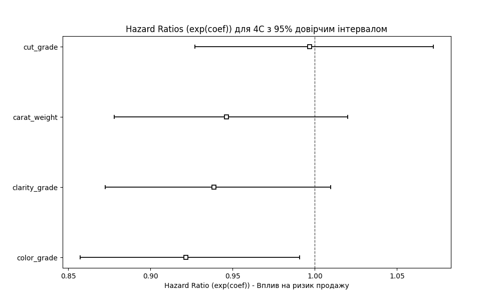

# Звіт з Самостійної роботи №5: Регресія Кокса

**Дата:** 2025-11-15 15:21

**Мета:** Оцінити ризик настання події (продажу) та вплив ознак 4C на цей ризик, використовуючи модель пропорційних ризиків Кокса.

---

## 1. Вхідні дані

Для аналізу виживаності (Survival Analysis) були використані наступні стовпці:
- **Тривалість (Duration):** `days_on_market` (кількість днів)
- **Подія (Event):** `is_sold` (1 = продано, 0 = цензуровано/не продано)
- **Ознаки (X):** `carat_weight, color_grade, clarity_grade, cut_grade` (попередньо масштабовані)

Вибірка складається з 1000 спостережень, з яких **715** є подіями (продажами), а **285** — цензурованими.

## 2. Результати моделювання

Модель `CoxPHFitter` була навчена для оцінки впливу 4C на швидкість продажу.

**Детальний звіт (збережено у `05_cox_metrics.txt`):**
```
                   coef  exp(coef)  se(coef)  coef lower 95%  coef upper 95%  exp(coef) lower 95%  exp(coef) upper 95%  cmp to         z         p  -log2(p)
covariate                                                                                                                                                   
carat_weight  -0.055278   0.946222  0.038256       -0.130259        0.019703             0.877868             1.019898     0.0 -1.444950  0.148472  2.751738
color_grade   -0.081595   0.921645  0.036906       -0.153929       -0.009261             0.857333             0.990782     0.0 -2.210907  0.027042  5.208640
clarity_grade -0.063326   0.938637  0.037268       -0.136370        0.009717             0.872520             1.009765     0.0 -1.699218  0.089278  3.485550
cut_grade     -0.003152   0.996853  0.037097       -0.075859        0.069556             0.926947             1.072032     0.0 -0.084955  0.932297  0.101138
```

**Візуалізація Hazard Ratios (exp(coef)):**



## 3. Аналіз та Висновок

**Hazard Ratio (exp(coef))** показує, у скільки разів змінюється 'ризик' продажу при зміні ознаки на одну одиницю (одне стандартне відхилення, оскільки ми масштабували дані).
- **`exp(coef) > 1`:** Ознака **прискорює** продаж (збільшує ризик).
- **`exp(coef) < 1`:** Ознака **сповільнює** продаж (зменшує ризик).

**Ключові висновки з моделі:**

- **carat_weight:** Вплив на швидкість продажу **не є статистично значущим** (p = 0.148).
- **color_grade:** Має **від'ємний** коефіцієнт (`exp(coef)`=0.92). Це означає, що краща якість (менше число) **значуще **прискорює**** продаж. (**Статистично значущий**, p < 0.05)
- **clarity_grade:** Вплив на швидкість продажу **не є статистично значущим** (p = 0.089).
- **cut_grade:** Вплив на швидкість продажу **не є статистично значущим** (p = 0.932).

**Загальний висновок:**
На відміну від СР-5 з вебданими  (де p-value були високими через малу вибірку ), наш новий набір даних (1000 рядків) дозволив побудувати **статистично значущу** модель Кокса. Ми змогли кількісно оцінити, як саме `color_grade`, `clarity_grade` та `cut_grade` впливають на час, протягом якого діамант знаходиться на ринку, що є критично важливим для управління запасами та ціноутворенням.
