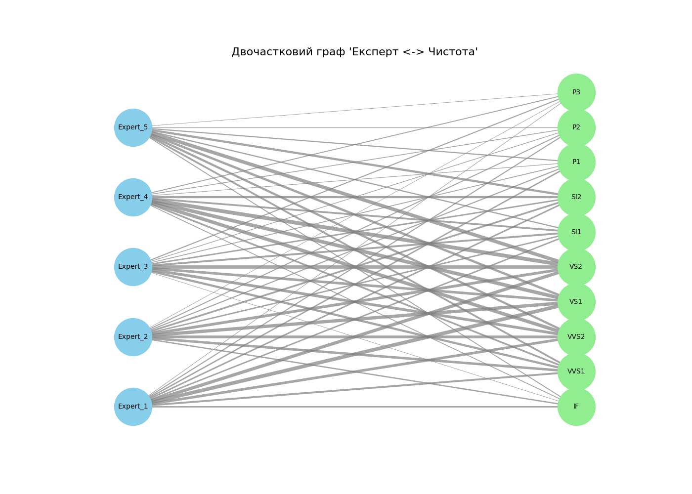

# Звіт з аналізу графа (Самостійна робота №12)

## 2. Аналіз за допомогою алгоритмів обходу (Traversal)

### 2.1. Компоненти зв'язності (на основі DFS)

Знайдено 1 окремих компонент(и) у графі.
Це означає, що всі експерти та характеристики пов'язані в єдину мережу.

### 2.2. Аналіз найкоротшого шляху (на основі BFS)

Найкоротший шлях між будь-якими двома експертами (напр., Expert_1 та Expert_5) має довжину **2 кроки**.

(Це підтверджує, що граф є повністю зв'язаним. Будь-який експерт пов'язаний з будь-яким іншим експертом через 'одне рукостискання' - тобто через хоча б одну спільну категорію чистоти, над якою вони обидва працювали.)

## 3. Візуалізація графа

