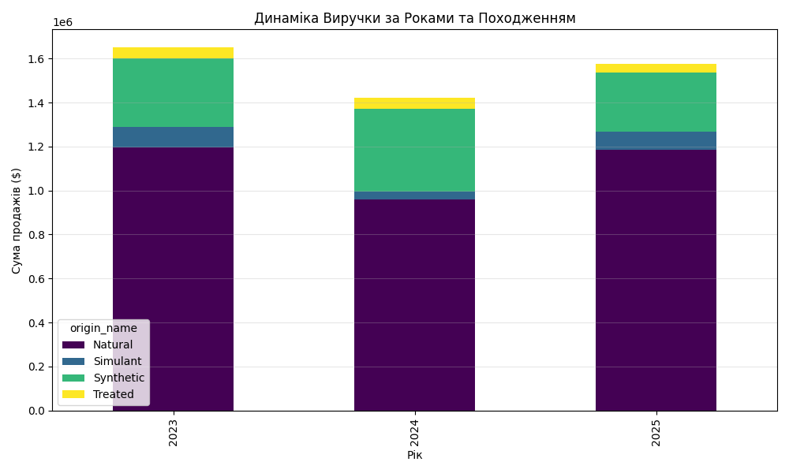
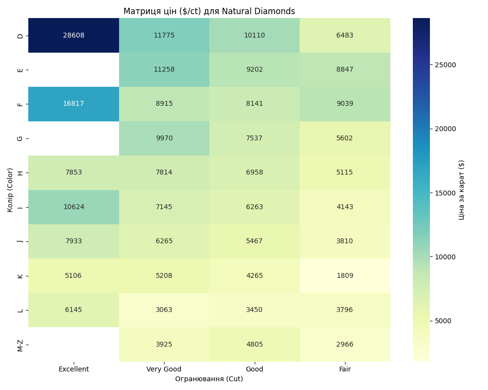

# Звіт з Практичної роботи №6: Побудова OLAP-зрізів

**Дата:** 2025-11-19 21:54

**Мета:** Спроєктувати та реалізувати складні аналітичні зрізи даних, використовуючи архітектурний патерн Singleton для доступу до Сховища Даних.

## 1. Архітектурне рішення
Для роботи з даними було реалізовано клас `DiamondDataWarehouse` з використанням патерну **Singleton**. Це гарантує, що завантаження та первинна обробка даних ('ETL') відбувається лише один раз, забезпечуючи єдину точку доступу до аналітичного сховища.

## 2. Стратегічний зріз: Динаміка Виручки
Аналіз суми продажів у розрізі років та типів каменів.

**Табличні дані ($):**
|   year |          Natural |   Simulant |   Synthetic |   Treated |
|-------:|-----------------:|-----------:|------------:|----------:|
|   2023 |      1.19544e+06 |      93046 |      313867 |     47519 |
|   2024 | 960087           |      36371 |      376386 |     47280 |
|   2025 |      1.18672e+06 |      79311 |      272192 |     36300 |

## 3. Операційний зріз: KPI Експертів
Аналіз ефективності роботи персоналу (співвідношення швидкості та якості).

**Табличні дані:**
| expert_name   |   Reports_Count |   Avg_Time |   Rejection_Rate |
|:--------------|----------------:|-----------:|-----------------:|
| Expert_1      |             209 |     67.469 |            0     |
| Expert_2      |             202 |     64.337 |            0     |
| Expert_4      |             222 |     71.365 |            0     |
| Expert_3      |             189 |     63.841 |            0.005 |
| Expert_5      |             178 |     66.803 |            0.169 |

## 4. Продуктовий зріз: Цінова Матриця (Natural)
Теплова карта середньої ціни за карат для природних діамантів.

**Табличні дані ($/ct):**
| color_name   |   Excellent |   Very Good |   Good |   Fair |
|:-------------|------------:|------------:|-------:|-------:|
| D            |       28608 |       11775 |  10110 |   6483 |
| E            |         nan |       11258 |   9202 |   8847 |
| F            |       16817 |        8915 |   8141 |   9039 |
| G            |         nan |        9970 |   7537 |   5602 |
| H            |        7853 |        7814 |   6958 |   5115 |
| I            |       10624 |        7145 |   6263 |   4143 |
| J            |        7933 |        6265 |   5467 |   3810 |
| K            |        5106 |        5208 |   4265 |   1809 |
| L            |        6145 |        3063 |   3450 |   3796 |
| M-Z          |         nan |        3925 |   4805 |   2966 |

## Висновок
У ході роботи було реалізовано три типи OLAP-зрізів (Стратегічний, Операційний, Продуктовий). Замість використання зовнішніх офісних додатків, було автоматизовано процес побудови аналітичної звітності безпосередньо в Python, отримавши готові для прийняття рішень візуалізації та таблиці.