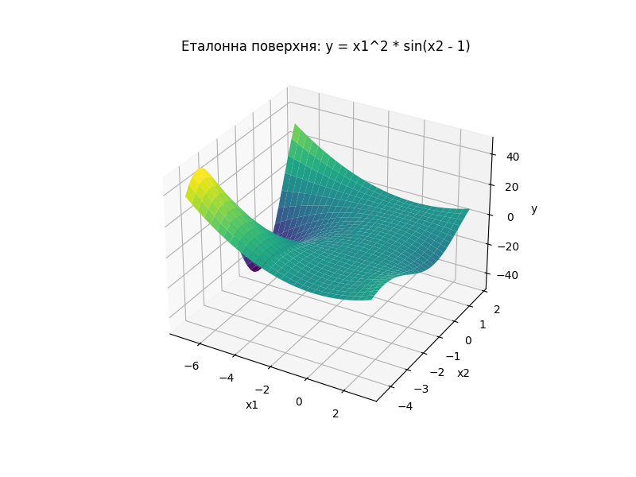
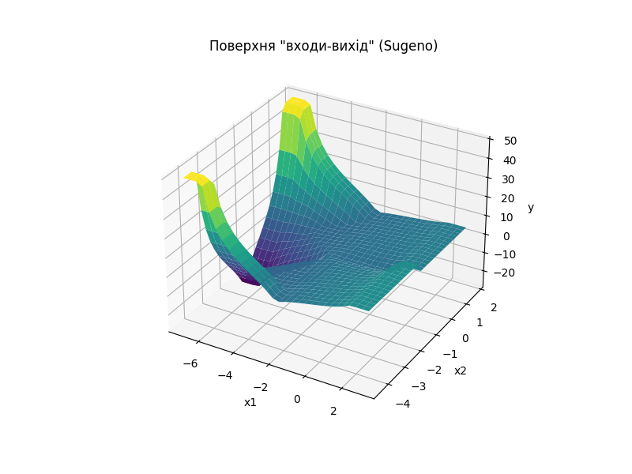
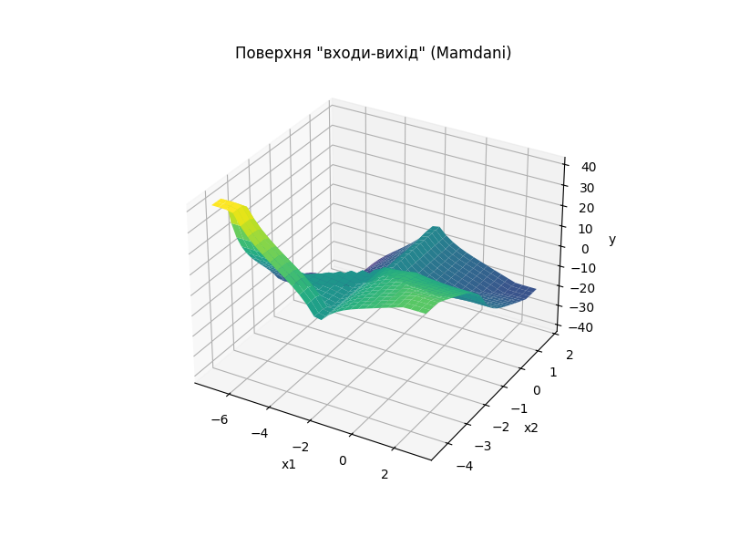

# Звіт з практичної роботи: Порівняння алгоритмів Мамдані та Сугено
**Дата:** 2025-10-20 11:24

## Мета роботи
Освоїти принципи роботи алгоритмів Мамдані та Сугено, порівняти їх ефективність на прикладі апроксимації нелінійної функції.

---
## Етап 1: Еталонна поверхня
Було побудовано еталонну 3D-поверхню для цільової функції $y = x_1^2 \cdot \sin(x_2 - 1)$ в діапазонах $x_1 \in [-7, 3]$ та $x_2 \in [-4.4, 1.7]$.

---
## Етап 2: Система типу Сугено (імітація)
Була реалізована система, що імітує поведінку Сугено нульового порядку за допомогою архітектури Мамдані з "синглтонними" (точковими) виходами.

---
## Етап 3: Класична система Мамдані
Була реалізована класична система типу Мамдані з широкими нечіткими множинами на виході.

---
### Таблиця правил нечіткого виведення

| № | Умова (x1, x2) | Вихід (y) | Тип системи |
|---|----------------|-----------|-------------|
| 1 | x1 = середній | y = 0 | Сугено |
| 2 | x1 = високий, x2 = високий | y = 5 | Сугено |
| 3 | x1 = високий, x2 = низький | y = 10 | Сугено |
| 4 | x1 = низький, x2 = середній | y = -30 | Сугено |
| 5 | x1 = низький, x2 = низький | y = 50 | Сугено |
| 6 | x1 = низький, x2 = високий | y = 50 | Сугено |
| 7 | x1 = низький, x2 = низький | y = дуже високий | Мамдані |
| 8 | x1 = низький, x2 = середній | y = низький | Мамдані |
| 9 | x1 = низький, x2 = високий | y = дуже низький | Мамдані |
|10 | x1 = середній | y = середній | Мамдані |
|11 | x1 = високий, x2 = низький | y = високий | Мамдані |
|12 | x1 = високий, x2 = середній | y = середній | Мамдані |
|13 | x1 = високий, x2 = високий | y = низький | Мамдані |

---
## Етап 4: Порівняльні висновки
- **Система, що імітує Сугено,** генерує ступінчату, кусково-постійну поверхню. Вона грубо апроксимує загальну форму функції, але повністю втрачає її плавність, що є наслідком імітації чітких виходів.
- **Класична система Мамдані** створює плавну, нелінійну поверхню, яка візуально значно краще відповідає складній формі еталонної функції. Це досягається за рахунок агрегації та дефазифікації широких нечітких множин на виході.
- **Висновок**: Для задач апроксимації складних функцій в середовищі `scikit-fuzzy`, **класичний алгоритм Мамдані є більш гнучким та ефективним інструментом**, ніж імітація Сугено.
