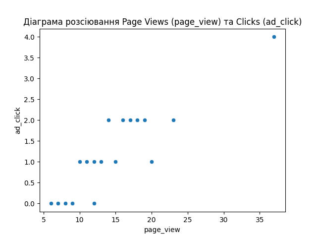

# Звіт: Кореляційний аналіз

## Мета

Визначити тип та тісноту взаємозв’язку між випадковими змінними.

## Метод

- Обрано коефіцієнт Пірсона
- Перевірено нормальність розподілу
- Побудовано графік

### Візуалізація

- 
- 

## Висновок

На основі вибірки спостерігається **сильний прямий зв’язок** між `page_view` та `ad_click`.  
Це свідчить про те, що зростання трафіку потенційно веде до зростання рекламної взаємодії.  
Зв’язок є статистично значущим (p-value < 0.001), що дозволяє відкинути нульову гіпотезу про його випадковість.

## Результати для Page Views (page_view) vs Clicks (ad_click)

- Дата: 2025-09-06 15:15
- Метод кореляції: Spearman
- Коефіцієнт: 0.8548
- p-value: 0.0000
- Тип зв’язку: прямий, сила: сильний
- Гістограми: 
- Scatterplot: 
