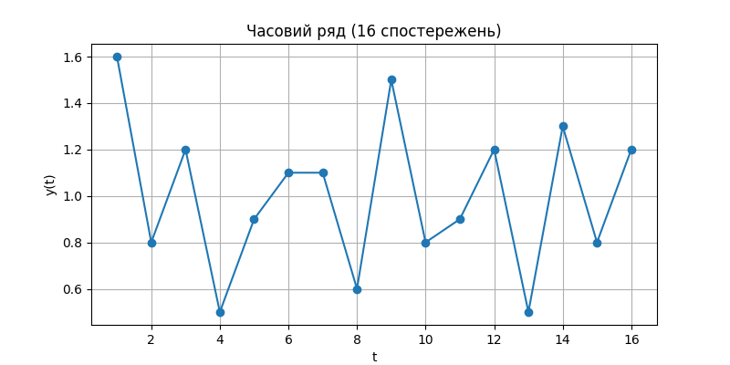
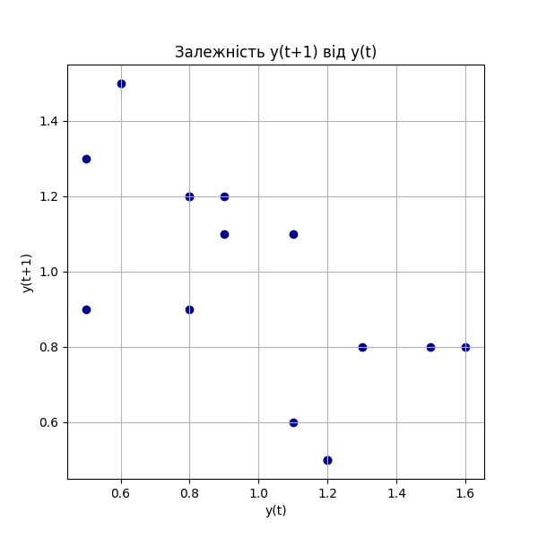

# Самостійна робота №11 — Аналіз часового ряду (Задача 1)

## Вхідні дані
Часовий ряд з 16 спостережень:
`[1.6, 0.8, 1.2, 0.5, 0.9, 1.1, 1.1, 0.6, 1.5, 0.8, 0.9, 1.2, 0.5, 1.3, 0.8, 1.2]`

## a) Графік часового ряду

## b) Наближена оцінка r₁ з графіка ряду
Візуальний аналіз графіка часового ряду показує часті коливання "вгору-вниз" (наприклад, 1.6 → 0.8, 1.2 → 0.5), що свідчить про ймовірну **від'ємну автокореляцію** першого порядку.

## c) Графік залежності y(t+1) від y(t) та точний r₁
Графік залежності $y(t+1)$ від $y(t)$ наочно демонструє структуру автокореляції:

Хмара точок витягнута з верхнього лівого кута в нижній правий, що візуально підтверджує наявність **від'ємної кореляції**.

**Точний розрахунок коефіцієнта автокореляції першого порядку:**
$r_1 = -0.6411$

## Висновок
Графічний аналіз та точний розрахунок узгоджуються: часовий ряд демонструє **помірну від'ємну автокореляцію** першого порядку ($r_1 \approx -0.64$). Це означає, що високі значення ряду мають тенденцію змінюватися низькими, і навпаки. Цю властивість слід враховувати при виборі та побудові прогнозної моделі для даного ряду.
