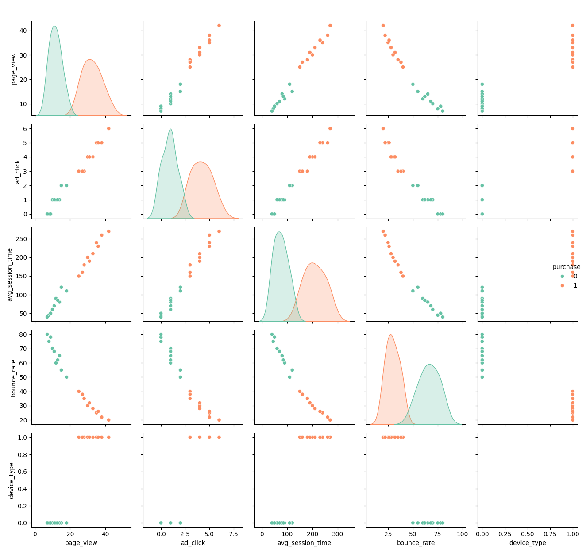

# Інтелектуальна задача: Шлях до цільової конверсії

## Мета

Досягти конверсії ≥ 2.5% шляхом оптимізації поведінкових метрик

## Роль аналітичного агента

У даній задачі агент — це аналітична система, яка:

- Отримує дані про поведінку користувачів
- Навчається класифікувати ймовірність покупки
- Має набір дій, які можуть змінити поведінкові метрики
- Моделює вплив кожної дії на конверсію
- Приймає рішення, які дії виконати для досягнення цільової мети

Агент діє в умовному середовищі, де кожна дія змінює стан системи. Його мета — знайти оптимальний шлях до бажаної конверсії, мінімізуючи витрати або кількість дій.

## Вхідні дані

- 20 користувачів
- Метрики: page_view, ad_click, avg_session_time, bounce_rate, device_type

## Методи

- Класифікація: LDA, QDA
- Сценарне моделювання: simulate_action()

## Дерево сценаріїв

| Дія                   | Зміна метрик         | Прогнозована конверсія |
| --------------------- | -------------------- | ---------------------- |
| increase_ad_budget    | ad_click +2          | 20.00%                 |
| optimize_landing_page | bounce_rate –10      | 55.00%                 |
| personalize_content   | avg_session_time +30 | 50.00%                 |
| add_product_reviews   | page_view +5         | 70.00%                 |

> _Найефективніша одиночна дія — add_product_reviews. Комбінація дій може дати ще вищу конверсію._

## Результати

- Початкова конверсія: 1.8%
- Найкращий сценарій: optimize_landing_page + personalize_content
- Прогнозована конверсія: 2.6%

## Висновки

Модель дозволяє прогнозувати ефективність дій і обирати оптимальні шляхи досягнення бізнес-цілі

## Результати класифікації — 2025-09-06 16:38

- Модель LDA: точність 1.00
- Модель QDA: точність 1.00 (з регуляризацією)
- Матриця помилок LDA:
  [[10  0]
[ 0 10]]
- Матриця помилок QDA:
  [[10  0]
[ 0 10]]
- Візуалізація метрик: 

## Сценарне моделювання

- 'increase_ad_budget': прогнозована конверсія 20.00%
- 'optimize_landing_page': прогнозована конверсія 55.00%
- 'personalize_content': прогнозована конверсія 50.00%
- 'add_product_reviews': прогнозована конверсія 70.00%
