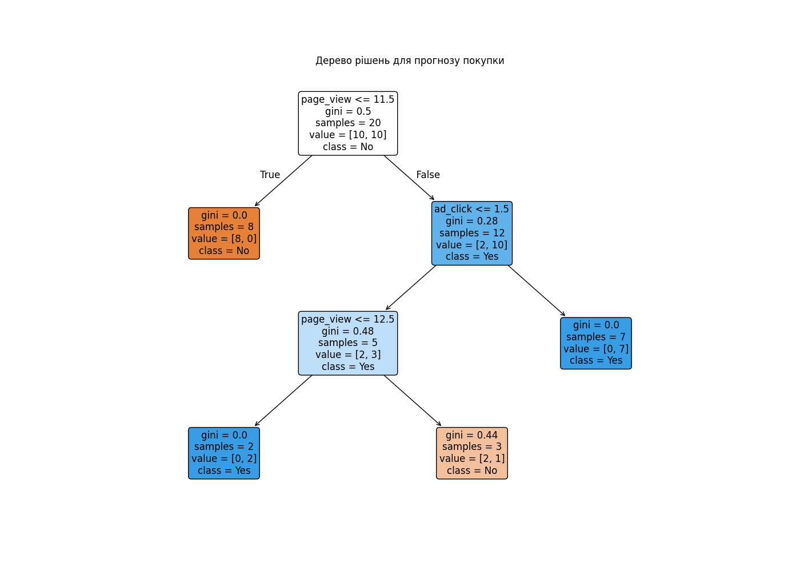

# Звіт: Побудова дерева рішень для прогнозу покупки

Дата: 2025-09-25 12:16

## Мета

Синтезувати модель дерева рішень для класифікації факту покупки на основі поведінкових ознак користувача (`page_view`, `ad_click`).

## Візуалізація



## Розрахунки

```
              precision    recall  f1-score   support

           0       0.91      1.00      0.95        10
           1       1.00      0.90      0.95        10

    accuracy                           0.95        20
   macro avg       0.95      0.95      0.95        20
weighted avg       0.95      0.95      0.95        20

Точність: 0.95
```

### Неправильно класифіковані об'єкти

| Місто   |   page_view |   ad_click |   purchase |   actual |   predicted |
|:--------|------------:|-----------:|-----------:|---------:|------------:|
| Дніпро  |          15 |          1 |          1 |        1 |           0 |

## Висновки

Модель досягла високої точності (95%) та дозволяє інтерпретувати логіку прийняття рішень. Виявлено граничний випадок (Дніпро), який може бути покращений шляхом додавання нових ознак або поглибленням дерева.
