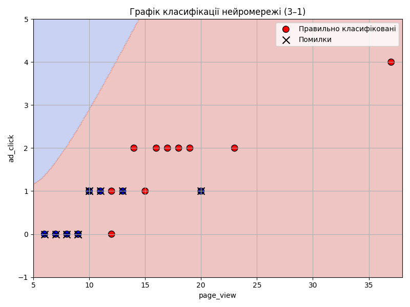

# Звіт: Нейронна мережа для прогнозу покупки

Дата: 2025-09-20 17:18

## Мета

Синтезувати одношарову нейромережу для класифікації факту покупки на основі поведінкових ознак (`page_view`, `ad_click`).

## Архітектура

- Кількість шарів: 2 (1 прихований + 1 вихідний)
- Структура: 3–1
- Функція активації: логістична сигмоїдна

## Розрахунки

```
              precision    recall  f1-score   support

           0       0.00      0.00      0.00        10
           1       0.50      1.00      0.67        10

    accuracy                           0.50        20
   macro avg       0.25      0.50      0.33        20
weighted avg       0.25      0.50      0.33        20

Точність: 0.50
```

### Неправильно класифіковані об'єкти (10):

| Місто         |   page_view |   ad_click |   purchase |   actual |   predicted |
|:--------------|------------:|-----------:|-----------:|---------:|------------:|
| Львів         |          20 |          1 |          0 |        0 |           1 |
| Одеса         |           8 |          0 |          0 |        0 |           1 |
| Черкаси       |          10 |          1 |          0 |        0 |           1 |
| Чернігів      |           9 |          0 |          0 |        0 |           1 |
| Суми          |          11 |          1 |          0 |        0 |           1 |
| Тернопіль     |          13 |          1 |          0 |        0 |           1 |
| Ужгород       |           7 |          0 |          0 |        0 |           1 |
| Житомир       |          10 |          1 |          0 |        0 |           1 |
| Кропивницький |           6 |          0 |          0 |        0 |           1 |
| Луцьк         |           9 |          0 |          0 |        0 |           1 |

## Графік класифікації

На графіку нижче показано, як нейромережа розділяє простір ознак `page_view` та `ad_click`.
Червоні точки — клас “купив”, сині — “не купив”.
Чорні хрестики — неправильно класифіковані об'єкти.



## Висновки

Модель досягла точності 0.50 та неправильно класифікувала 10 об'єктів.
Це свідчить про наявність граничних випадків, які можуть бути покращені шляхом:
- Додавання нових ознак (наприклад, `page_view * ad_click`)
- Зміни архітектури (більше нейронів або шарів)
- Спробування іншої функції активації (`tanh`, `relu`)
