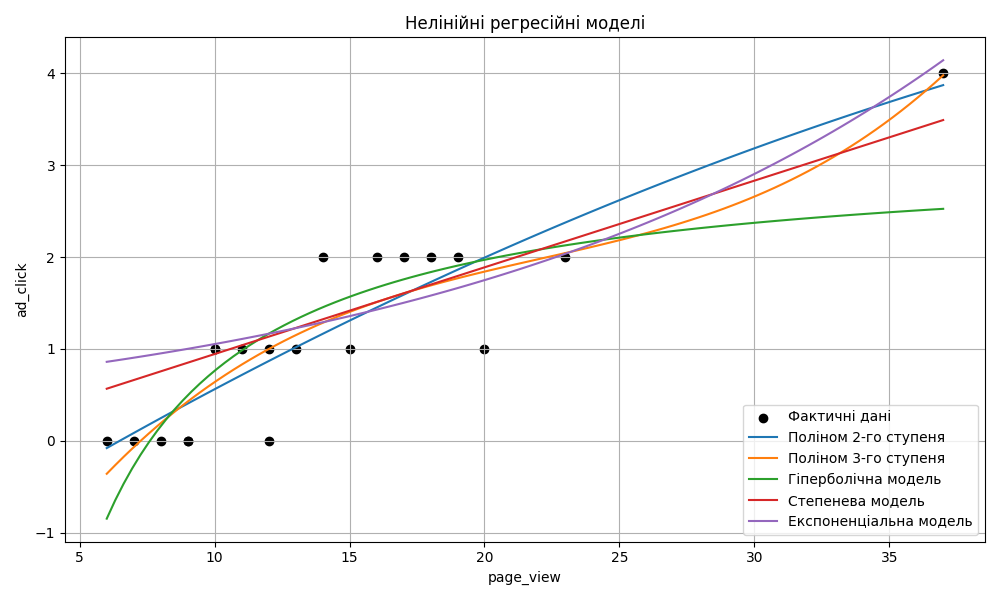

# Звіт: Нелінійний регресійний аналіз

**Дата:** 2025-09-20 22:58

**Мета:** Дослідити форму зв’язку між кількістю переглядів сторінки (`page_view`) та кількістю кліків по рекламі (`ad_click`) за допомогою різних нелінійних регресійних моделей.

## Вхідні дані

Вибірка містить 20 міст України з такими ознаками:

- `page_view` — кількість переглядів сторінки
- `ad_click` — кількість кліків по рекламі

## Побудовані моделі

| Модель | Формула регресії | R² |
|--------|------------------|----|
| Поліном 2-го ступеня | `Y=-0.00X² + 0.18X + -1.11` | 0.80 |
| Поліном 3-го ступеня | `Y=0.00X³ + -0.02X² + 0.51X + -2.78` | 0.82 |
| Гіперболічна модель | `Y=3.18 + -24.16/X` | 0.67 |
| Степенева модель | `Y=0.09 * X^1.00` | 0.75 |
| Експоненціальна модель | `Y=0.63 * e^(0.05X)` | 0.76 |

## Візуалізація

На графіку нижче показано фактичні дані (чорні точки) та криві всіх моделей:

## Висновки

- Найкраще апроксимує залежність **поліном 3-го ступеня** (R² = 0.82)
- **Степенева модель** також показала високу якість (R² = 0.75) і є простішою для інтерпретації
- **Гіперболічна та експоненціальна моделі** мають нижчі R², але можуть бути корисні для опису граничних випадків
- Всі моделі демонструють **нелінійний характер зв’язку** між `page_view` та `ad_click`

## Рекомендації

- Для подальшого аналізу варто протестувати моделі на нових даних або додати додаткові ознаки (наприклад, взаємодію `page_view * ad_click`)
- Можна порівняти ці результати з класифікаційними моделями з Практичної 1

