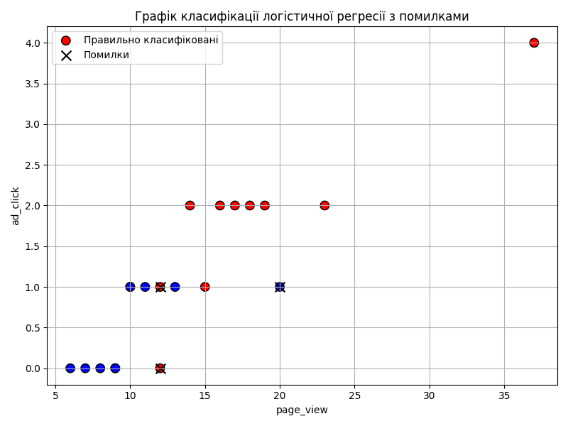
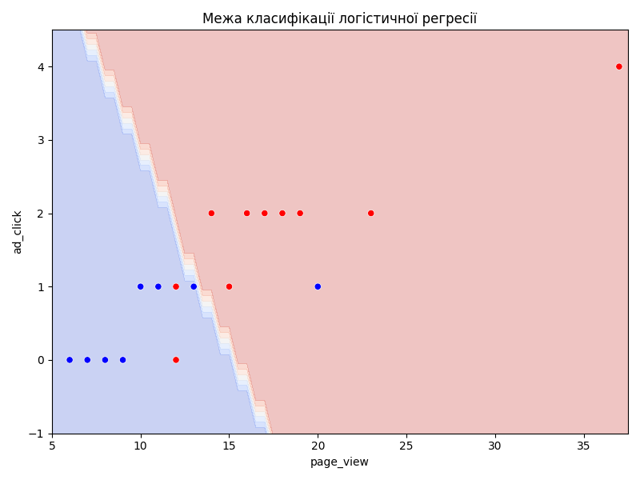
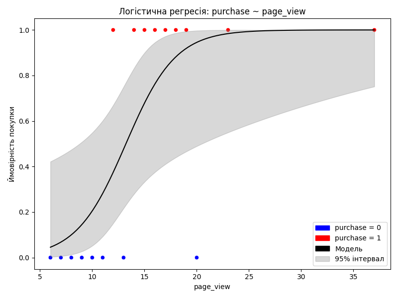
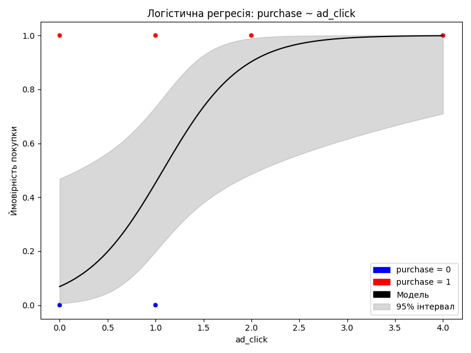

# Звіт: Логістична регресія

Дата: 2025-09-20 20:03

**Точність (accuracy):** 0.85

## Класифікаційний звіт
```
              precision    recall  f1-score   support

           0       0.82      0.90      0.86        10
           1       0.89      0.80      0.84        10

    accuracy                           0.85        20
   macro avg       0.85      0.85      0.85        20
weighted avg       0.85      0.85      0.85        20

```
## Матриця помилок
```
[[9 1]
 [2 8]]
```

## Неправильно класифіковані об'єкти (3):

У таблиці нижче наведено об'єкти, які модель класифікувала неправильно:

| Місто     |   page_view |   ad_click |   purchase |   actual |   predicted |
|:----------|------------:|-----------:|-----------:|---------:|------------:|
| Львів     |          20 |          1 |          0 |        0 |           1 |
| Запоріжжя |          12 |          0 |          1 |        1 |           0 |
| Рівне     |          12 |          1 |          1 |        1 |           0 |

## Графік класифікації з помилками
На графіку нижче показано, як модель логістичної регресії розділяє простір ознак `page_view` та `ad_click`.
Червоні точки — клас “купив”, сині — “не купив”.
Чорні хрестики — неправильно класифіковані об'єкти.




## Межа класифікації логістичної регресії
На графіку показано, як модель логістичної регресії розділяє простір ознак `page_view` та `ad_click`.
Фон зафарбований відповідно до передбаченого класу: червоний — не купив, синій — купив.
Точки — реальні об'єкти, кольором позначено фактичний клас.


## Логістична крива для ознаки `page_view`
На графіку показано, як змінюється ймовірність покупки залежно від кількості переглядів сторінок.
Чорна крива — модель логістичної регресії, сірий фон — 95% довірчий інтервал.


## Логістична крива для ознаки `ad_click`
На графіку показано, як змінюється ймовірність покупки залежно від кількості кліків по рекламі.
Чорна крива — модель логістичної регресії, сірий фон — 95% довірчий інтервал.

