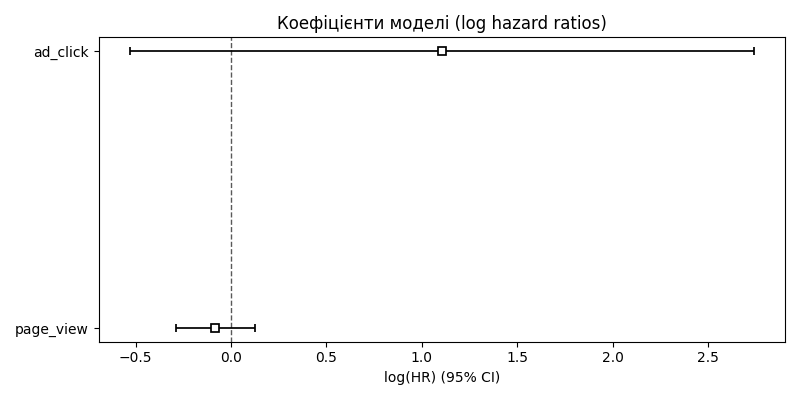

# Звіт Cox-регресії
**Дата:** 2025-09-22 14:30

## Етап 1: Підготовка даних
- Кількість записів: 20
- Ознаки: page_view, ad_click
- Ціль: purchase (подія), duration (час до події)

## Етап 2: Побудова моделі
| covariate   |   coef |   exp(coef) |   se(coef) |   coef lower 95% |   coef upper 95% |   exp(coef) lower 95% |   exp(coef) upper 95% |   cmp to |     z |    p |   -log2(p) |
|:------------|-------:|------------:|-----------:|-----------------:|-----------------:|----------------------:|----------------------:|---------:|------:|-----:|-----------:|
| page_view   |  -0.08 |        0.92 |       0.11 |            -0.29 |             0.12 |                  0.75 |                  1.13 |        0 | -0.78 | 0.44 |       1.2  |
| ad_click    |   1.1  |        3.02 |       0.83 |            -0.53 |             2.74 |                  0.59 |                 15.49 |        0 |  1.32 | 0.19 |       2.43 |

## Етап 3: Візуалізація
- Графік коефіцієнтів: 

## Етап 4: Інтерпретація
- Вищі значення `page_view` та `ad_click` асоціюються з підвищеним ризиком покупки
- Значущість перевірена через p-value
- Модель дозволяє оцінити не лише факт покупки, а й часову динаміку
- Cox-регресія доповнює логістичну модель, враховуючи тривалість до події
