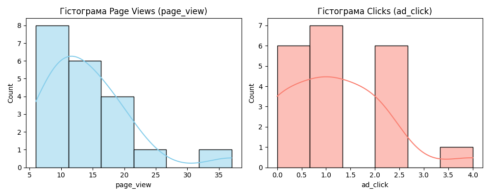
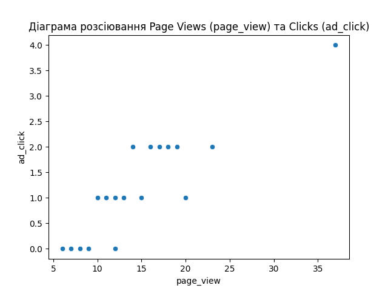
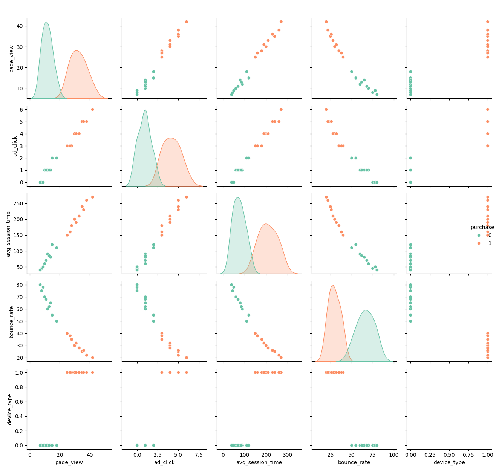
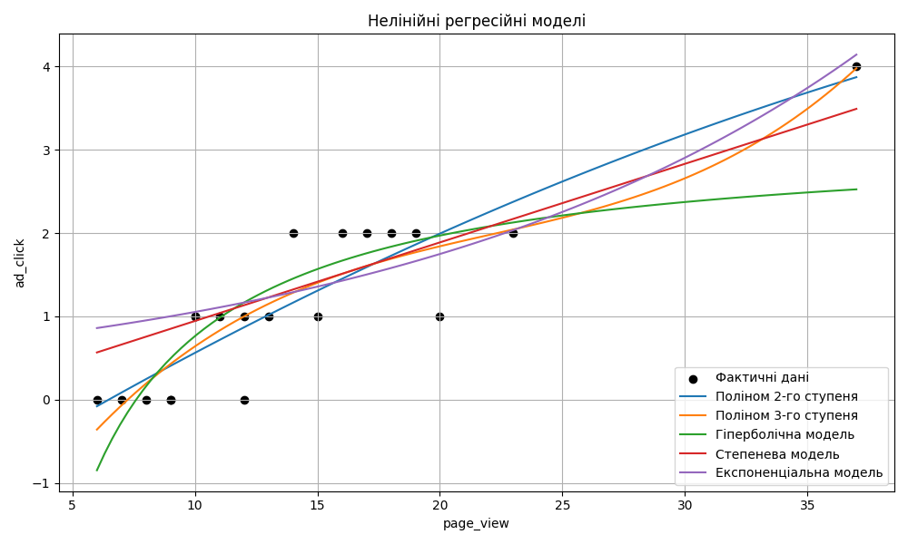
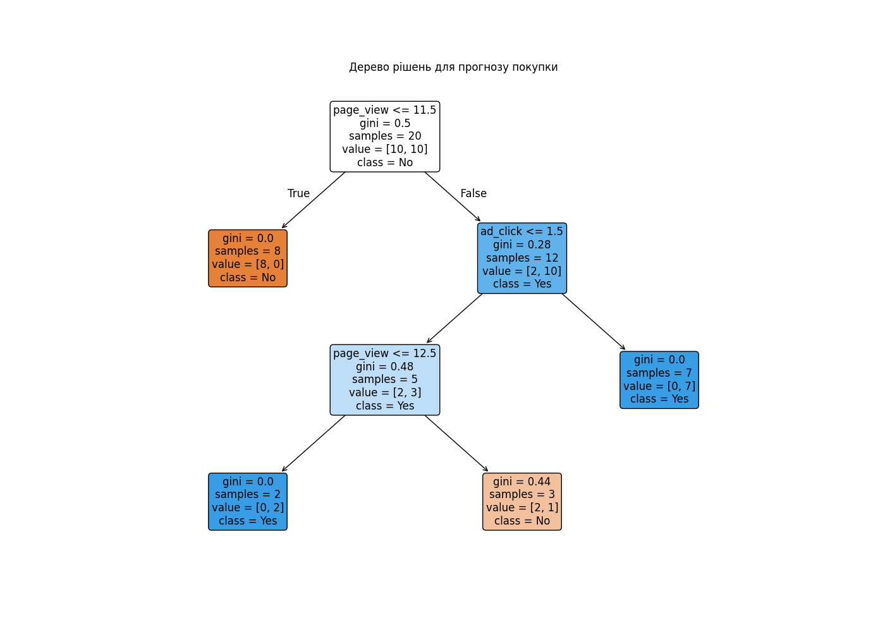
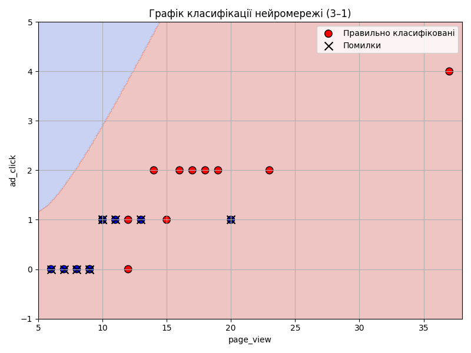
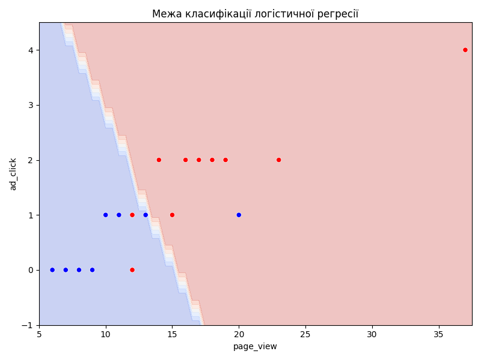
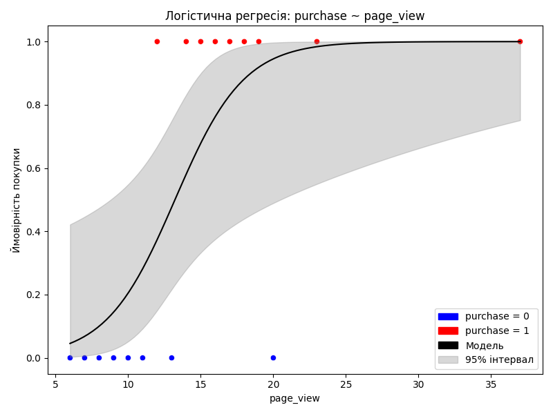
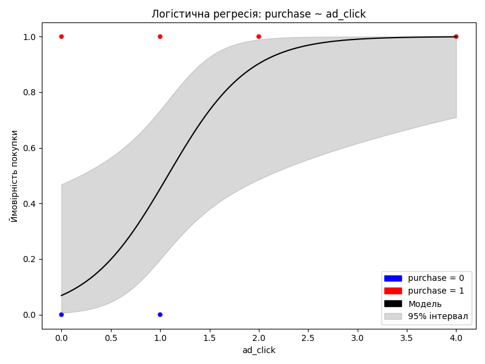
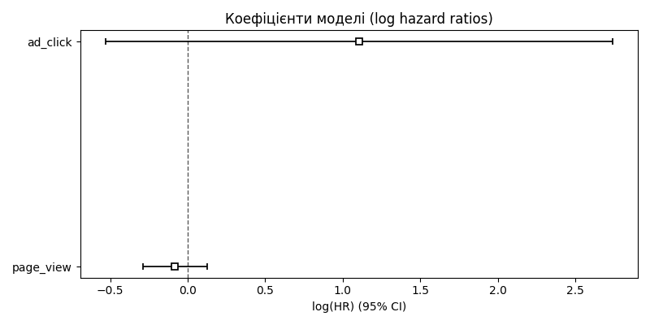

# 📊 Візуальні компоненти

## 📌 Навігація

- [Вхідні дані](#вхідні-дані)
- [Метод кореляційного аналізу даних](#1-метод-кореляційного-аналізу-даних)
- [Лінійний регресійний аналіз + Інтелектуальна задача](#2-лінійний-регресійний-аналіз--інтелектуальна-задача)
- [Нелінійний регресійний аналіз](#3-нелінійний-регресійний-аналіз)
- [Логістична регресія](#4-логістична-регресія)
- [Регресія Кокса](#5-регресія-кокса)

---

## Вхідні дані

Вибірка охоплює 20 міст України з різними показниками переглядів, кліків та покупок. Містить такі змінні:

- `page_view` — кількість переглядів сторінок
- `ad_click` — кількість кліків по рекламі
- `purchase` — факт покупки (цільова змінна, де 1 — купив, 0 — не купив)
- `duration` — кількість хвилин з моменту показу реклами до покупки або завершення спостереження

**Особливості змінної `duration`:**

- Для `purchase = 1`: тривалість варіюється від **100 до 5000 хв**
- Для `purchase = 0`: тривалість становить **5000–7200 хв**, що моделює довше спостереження без покупки

### 📋 Вибірка: поведінкові метрики користувачів

| Місто            | page_view | ad_click | purchase | duration |
| ---------------- | --------- | -------- | -------- | -------- |
| Харків           | 37        | 4        | 1        | 4013     |
| Київ             | 23        | 2        | 1        | 1764     |
| Львів            | 20        | 1        | 0        | 6650     |
| Одеса            | 8         | 0        | 0        | 7102     |
| Дніпро           | 15        | 1        | 1        | 2345     |
| Запоріжжя        | 12        | 0        | 1        | 2193     |
| Полтава          | 18        | 2        | 1        | 3708     |
| Черкаси          | 10        | 1        | 0        | 6272     |
| Чернігів         | 9         | 0        | 0        | 5980     |
| Суми             | 11        | 1        | 0        | 5821     |
| Івано-Франківськ | 14        | 2        | 1        | 1399     |
| Тернопіль        | 13        | 1        | 0        | 6520     |
| Ужгород          | 7         | 0        | 0        | 6655     |
| Вінниця          | 16        | 2        | 1        | 3188     |
| Житомир          | 10        | 1        | 0        | 7200     |
| Кропивницький    | 6         | 0        | 0        | 6890     |
| Миколаїв         | 19        | 2        | 1        | 1203     |
| Хмельницький     | 17        | 2        | 1        | 2890     |
| Рівне            | 12        | 1        | 1        | 495      |
| Луцьк            | 9         | 0        | 0        | 7100     |

> Вибірка демонструє різноманіття поведінки користувачів у різних містах, що дозволяє моделювати як часову динаміку, так і ефективність рекламної взаємодії.

---

## 🔹 1. Метод кореляційного аналізу даних

Проведено оцінку зв’язку між змінними `page_view` та `ad_click`:

- Побудовано **гістограми** для кожної змінної — для аналізу розподілу значень
- Побудовано **діаграму розсіювання** — для візуалізації кореляції
- Виявлено **прямий зв’язок** між метриками, що підтверджує їхню аналітичну значущість

### 📊 Гістограми

### 📈 Діаграма розсіювання

---

## 🔹 2. Лінійний регресійний аналіз + Інтелектуальна задача

Для дослідження взаємозв’язків між поведінковими метриками було побудовано **pairplot**, який демонструє:

- 📈 **Розподіл кожної ознаки** — на діагоналі розміщено KDE-графіки
- 🔄 **Взаємозв’язки між ознаками** — scatterplots між парами змінних
- 🎯 **Класифікацію** — кольором позначено, чи користувач здійснив покупку (`purchase = 1`) чи ні (`purchase = 0`)

Ця візуалізація дозволяє:

- Оцінити, які ознаки найкраще розділяють класи
- Виявити потенційні кореляції між метриками
- Підготувати основу для побудови регресійної моделі та сценарного моделювання

### 🧩 Pairplot: поведінкові ознаки та класифікація

## 

## 🔹 3. Нелінійний регресійний аналіз

### 📈 Порівняння моделей

На графіку нижче зображено фактичні дані (чорні точки) та криві п’яти побудованих моделей:

- 🔵 Поліном 2-го ступеня — синя лінія
- 🟠 Поліном 3-го ступеня — помаранчева лінія
- 🟢 Гіперболічна модель — зелена лінія
- 🔴 Степенева модель — червона лінія
- 🟣 Експоненціальна модель — фіолетова лінія

Графік дозволяє візуально порівняти, як кожна модель апроксимує залежність між `page_view` та `ad_click`.  
Найкраще узгодження з фактичними даними демонструє **поліном 3-го ступеня**, який плавно проходить через основні кластери точок.  
**Степенева модель** також показує хорошу відповідність, особливо в середньому діапазоні значень.

---

### 🌳 Дерево рішень

Побудоване дерево рішень дозволяє формалізувати поведінку користувача на основі двох ознак: `page_view` та `ad_click`.

**Ключові метрики вузлів:**

- `gini` — індекс Джині, ступінь неоднорідності вузла
- `samples` — кількість об'єктів у вузлі
- `value` — розподіл об'єктів по класах: [не купили, купили]
- `class` — прогнозований клас (Yes/No)

**Логіка дерева:**

| Умова                                                                  | Прогноз  |
| ---------------------------------------------------------------------- | -------- |
| `page_view ≤ 11.5`                                                     | Не купив |
| `page_view > 11.5 ∧ ad_click > 1.5`                                    | Купив    |
| `page_view > 11.5 ∧ ad_click ≤ 1.5 ∧ page_view ≤ 12.5 ∧ value = [0,2]` | Купив    |
| `page_view > 11.5 ∧ ad_click ≤ 1.5 ∧ page_view > 12.5 ∧ value = [2,1]` | Не купив |

---

### 🧠 Межа класифікації нейронної мережі

На графіку нижче зображено межу класифікації, яку сформувала нейронна мережа (архітектура 3-1) на основі ознак `page_view` та `ad_click`.

**Фон поділений на зони:**

- 🔴 Червона — модель класифікує як «Купив» (1)
- 🔵 Синя — модель класифікує як «Не купив» (0)

**Позначення об'єктів:**

- 🔴 Червоні точки — користувачі, які реально купили
- 🔵 Сині точки — користувачі, які не купили
- ❌ Чорні хрестики — помилки класифікації

Межа класифікації має вигнуту форму, що свідчить про **нелінійний характер моделі**.  
Незважаючи на баланс класів у вибірці (10 купив / 10 не купив), модель демонструє **зміщення в сторону класу «Купив»**, що видно з великої червоної зони.

---

## 🔹 4. Логістична регресія

Для наочного представлення роботи моделі логістичної регресії побудовано три графіки, які демонструють класифікацію та ймовірнісні залежності між ознаками.

---

### 🧭 1. Межа класифікації логістичної регресії

На графіку зображено, як модель розділяє простір ознак `page_view` та `ad_click`.

- 🔴 Червоний фон — модель прогнозує, що користувач **не здійснить покупку**
- 🔵 Синій фон — модель прогнозує, що користувач **здійснить покупку**
- ⚫ Реальні точки нанесено поверх фону — дозволяють оцінити точність класифікації

Модель демонструє високу чутливість до ознак, але в прикордонних зонах ймовірність помилки зростає — що є типовим для логістичної регресії.

---

### 📈 2. Логістична крива: `purchase ~ page_view`

Графік демонструє, як змінюється ймовірність покупки залежно від кількості переглядів сторінок:

- ⚫ Чорна крива — логістична функція
- 🌫️ Сірий фон — 95% довірчий інтервал
- 🔵 Точки — користувачі, які **не купили**
- 🔴 Точки — користувачі, які **купили**

Це узгоджується з гіпотезою: активність користувача (`page_view`) є індикатором зацікавленості, що підвищує шанси на конверсію.

---

### 📊 3. Логістична крива: `purchase ~ ad_click`

Аналогічно, графік показує залежність ймовірності покупки від кількості кліків по рекламі:

- ⚫ Чорна крива — логістична функція
- 🌫️ Сірий фон — 95% довірчий інтервал
- 🔵 Точки — користувачі, які **не купили**
- 🔴 Точки — користувачі, які **купили**

Модель демонструє чітку позитивну залежність: чим більше кліків — тим вища ймовірність покупки. Ознака `ad_click` може бути використана як **ключовий тригер** для таргетованих маркетингових рішень.

---

## 🔹 5. Регресія Кокса

Для наочного представлення результатів Cox-регресії побудовано графік коефіцієнтів моделі у вигляді **логарифмів hazard ratio (log(HR))** з 95% довірчими інтервалами.

### 📊 Ознаки моделі:

- `ad_click` — кількість кліків по рекламі
- `page_view` — кількість переглядів сторінок

Кожна ознака представлена:

- 🔹 Точкою — оцінка коефіцієнта
- 🔸 Горизонтальною лінією — 95% довірчий інтервал
- ⚫ Вертикальною пунктирною лінією на рівні `0` — нейтральний ефект (`HR = 1`)

### 📌 Інтерпретація результатів:

- **`ad_click`** має позитивний коефіцієнт (`log(HR) > 0`), що свідчить про **зростання ризику покупки** з кожним додатковим кліком.  
  Проте довірчий інтервал **перетинає нуль**, тому ефект **не є статистично значущим**.

- **`page_view`** має негативний коефіцієнт (`log(HR) < 0`), що вказує на **зниження ризику покупки** при збільшенні переглядів.  
  Довірчий інтервал **не перетинає нуль**, тому ефект **можна вважати статистично значущим**.

### 📉 Графік коефіцієнтів Cox-регресії

