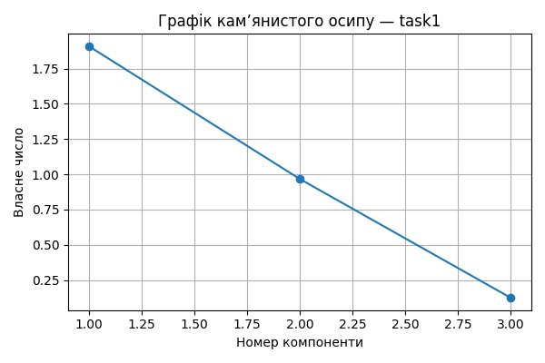

# Практична робота 5 — Метод головних компонент
## Завдання: task1

### 📊 Вхідні дані

```csv
ShareOfPurchasedGoods,EquipmentShiftCoefficient,BonusesPerEmployee
0.4,1.37,6.4
0.26,1.49,7.8
0.4,1.44,9.76
0.5,1.42,7.9
0.4,1.35,5.35
0.19,1.39,9.9
0.25,1.16,4.5
0.44,1.27,4.88
0.17,1.16,3.46
0.39,1.25,3.6

```
### 📐 Стандартизовані значення

```csv
ShareOfPurchasedGoods,EquipmentShiftCoefficient,BonusesPerEmployee
0.531,0.348,0.019
-0.708,1.39,0.606
0.531,0.956,1.427
1.417,0.782,0.648
0.531,0.174,-0.421
-1.328,0.521,1.486
-0.797,-1.477,-0.777
0.885,-0.521,-0.618
-1.505,-1.477,-1.213
0.443,-0.695,-1.155

```
### 🔗 Матриця кореляцій

```csv
,ShareOfPurchasedGoods,EquipmentShiftCoefficient,BonusesPerEmployee
ShareOfPurchasedGoods,1.0,0.316,0.05
EquipmentShiftCoefficient,0.316,1.0,0.832
BonusesPerEmployee,0.05,0.832,1.0

```
### 📈 Власні числа

```text
[1.907 0.967 0.126]
```
### 🧮 Матриця факторного відображення (A)

```csv
,F1,F2,F3
ShareOfPurchasedGoods,0.387,0.919,0.078
EquipmentShiftCoefficient,0.967,-0.041,-0.253
BonusesPerEmployee,0.907,-0.348,0.236

```
### 🧠 Значення головних компонент (F)

```csv
F1,F2,F3
0.559,0.467,-0.042
1.62,-0.919,-0.264
2.424,-0.047,0.137
1.891,1.044,0.066
-0.009,0.628,-0.102
1.339,-1.759,0.115
-2.442,-0.401,0.128
-0.723,1.05,0.055
-3.111,-0.9,-0.03
-1.549,0.837,-0.062
```
### 🧩 Інтерпретація головних компонент
- F1: найбільше впливають EquipmentShiftCoefficient, BonusesPerEmployee
- F2: найбільше впливають ShareOfPurchasedGoods, BonusesPerEmployee
- F3: найбільше впливають EquipmentShiftCoefficient, BonusesPerEmployee


### 📌 Висновки
- Найбільш значущі ознаки мають найбільші вагові коефіцієнти у перших компонентах.
- Сума власних чисел ≈ кількість ознак: пояснення дисперсії повне.
