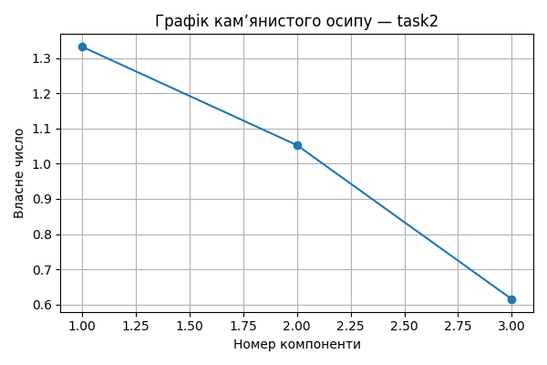

# Практична робота 5 — Метод головних компонент
## Завдання: task2

### 📊 Вхідні дані

```csv
ShareOfPurchasedGoods,EquipmentShiftCoefficient,BonusesPerEmployee
0.4,1.37,1.23
0.26,1.49,1.04
0.4,1.44,1.8
0.5,1.42,0.43
0.4,1.35,0.88
0.19,1.39,0.57
0.25,1.16,1.75
0.44,1.27,1.7
0.17,1.16,0.84
0.39,1.25,0.6

```
### 📐 Стандартизовані значення

```csv
ShareOfPurchasedGoods,EquipmentShiftCoefficient,BonusesPerEmployee
0.531,0.348,0.284
-0.708,1.39,-0.085
0.531,0.956,1.391
1.417,0.782,-1.27
0.531,0.174,-0.396
-1.328,0.521,-0.998
-0.797,-1.477,1.293
0.885,-0.521,1.196
-1.505,-1.477,-0.474
0.443,-0.695,-0.94

```
### 🔗 Матриця кореляцій

```csv
,ShareOfPurchasedGoods,EquipmentShiftCoefficient,BonusesPerEmployee
ShareOfPurchasedGoods,1.0,0.316,0.066
EquipmentShiftCoefficient,0.316,1.0,-0.162
BonusesPerEmployee,0.066,-0.162,1.0

```
### 📈 Власні числа

```text
[1.332 1.053 0.615]
```
### 🧮 Матриця факторного відображення (A)

```csv
,F1,F2,F3
ShareOfPurchasedGoods,-0.748,0.449,0.489
EquipmentShiftCoefficient,-0.839,-0.116,-0.531
BonusesPerEmployee,0.261,0.915,-0.307

```
### 🧠 Значення головних компонент (F)

```csv
F1,F2,F3
-0.615,0.458,-0.012
-0.659,-0.557,-1.059
-0.837,1.401,-0.674
-2.047,-0.618,0.667
-0.646,-0.144,0.289
0.296,-1.57,-0.62
2.173,0.997,-0.002
0.087,1.553,0.343
2.242,-0.938,0.194
0.007,-0.582,0.874
```
### 🧩 Інтерпретація головних компонент
- F1: найбільше впливають EquipmentShiftCoefficient, ShareOfPurchasedGoods
- F2: найбільше впливають BonusesPerEmployee, ShareOfPurchasedGoods
- F3: найбільше впливають EquipmentShiftCoefficient, ShareOfPurchasedGoods


### 📌 Висновки
- Найбільш значущі ознаки мають найбільші вагові коефіцієнти у перших компонентах.
- Сума власних чисел ≈ кількість ознак: пояснення дисперсії повне.
