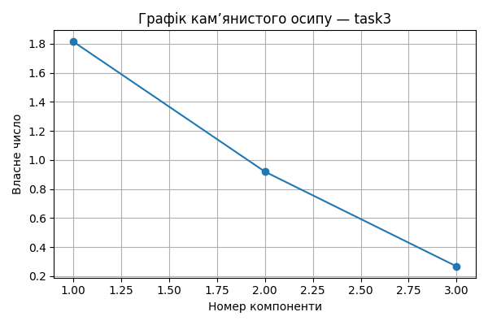

# Практична робота 5 — Метод головних компонент
## Завдання: task3

### 📊 Вхідні дані

```csv
LaborProductivity,CapitalReturn,Profitability
9.26,1.45,13.26
9.38,1.3,10.16
12.11,1.37,13.72
10.81,1.65,12.85
9.35,1.91,10.63
9.87,1.68,9.12
8.17,1.94,25.83
9.12,1.89,23.39
5.88,1.94,14.68
6.3,2.06,10.05

```
### 📐 Стандартизовані значення

```csv
LaborProductivity,CapitalReturn,Profitability
0.125,-0.997,-0.194
0.189,-1.552,-0.736
1.642,-1.293,-0.113
0.95,-0.256,-0.265
0.173,0.708,-0.653
0.45,-0.144,-0.917
-0.455,0.819,2.003
0.051,0.634,1.576
-1.674,0.819,0.054
-1.451,1.263,-0.755

```
### 🔗 Матриця кореляцій

```csv
,LaborProductivity,CapitalReturn,Profitability
LaborProductivity,1.0,-0.697,-0.106
CapitalReturn,-0.697,1.0,0.328
Profitability,-0.106,0.328,1.0

```
### 📈 Власні числа

```text
[1.815 0.919 0.266]
```
### 🧮 Матриця факторного відображення (A)

```csv
,F1,F2,F3
LaborProductivity,-0.853,0.398,0.337
CapitalReturn,0.924,-0.086,0.373
Profitability,0.483,0.868,-0.118

```
### 🧠 Значення головних компонент (F)

```csv
F1,F2,F3
-1.121,-0.033,-0.307
-1.951,-0.43,-0.428
-2.65,0.666,0.085
-1.175,0.17,0.256
0.191,-0.559,0.399
-0.96,-0.605,0.206
2.112,1.487,-0.084
1.303,1.334,0.068
2.211,-0.69,-0.265
2.04,-1.341,0.071
```
### 🧩 Інтерпретація головних компонент
- F1: найбільше впливають CapitalReturn, LaborProductivity
- F2: найбільше впливають Profitability, LaborProductivity
- F3: найбільше впливають CapitalReturn, LaborProductivity


### 📌 Висновки
- Найбільш значущі ознаки мають найбільші вагові коефіцієнти у перших компонентах.
- Сума власних чисел ≈ кількість ознак: пояснення дисперсії повне.
