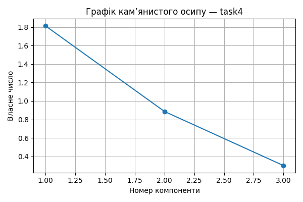

# Практична робота 5 — Метод головних компонент
## Завдання: task4

### 📊 Вхідні дані

```csv
BonusesPerEmployee,CapitalReturn,LaborProductivity
1.33,1.45,9.26
1.04,1.3,9.38
1.8,1.37,12.11
0.43,1.65,10.81
0.88,1.91,9.35
0.57,1.68,9.87
1.75,1.94,8.17
1.7,1.89,9.12
0.84,1.94,5.88
0.6,2.06,6.3

```
### 📐 Стандартизовані значення

```csv
BonusesPerEmployee,CapitalReturn,LaborProductivity
0.455,-0.997,0.125
-0.104,-1.552,0.189
1.36,-1.293,1.642
-1.279,-0.256,0.95
-0.412,0.708,0.173
-1.01,-0.144,0.45
1.264,0.819,-0.455
1.168,0.634,0.051
-0.489,0.819,-1.674
-0.952,1.263,-1.451

```
### 🔗 Матриця кореляцій

```csv
,BonusesPerEmployee,CapitalReturn,LaborProductivity
BonusesPerEmployee,1.0,-0.189,0.246
CapitalReturn,-0.189,1.0,-0.697
LaborProductivity,0.246,-0.697,1.0

```
### 📈 Власні числа

```text
[1.813 0.886 0.301]
```
### 🧮 Матриця факторного відображення (A)

```csv
,F1,F2,F3
BonusesPerEmployee,0.477,-0.878,-0.035
CapitalReturn,-0.881,-0.279,0.381
LaborProductivity,0.899,0.192,0.392

```
### 🧠 Значення головних компонент (F)

```csv
F1,F2,F3
1.208,-0.098,-0.347
1.489,0.56,-0.514
3.265,-0.519,0.103
0.47,1.378,0.32
-0.665,0.198,0.352
0.051,1.014,0.157
-0.529,-1.426,0.089
0.044,-1.192,0.22
-2.461,-0.12,-0.327
-2.872,0.205,-0.054
```
### 🧩 Інтерпретація головних компонент
- F1: найбільше впливають LaborProductivity, CapitalReturn
- F2: найбільше впливають BonusesPerEmployee, CapitalReturn
- F3: найбільше впливають LaborProductivity, CapitalReturn


### 📌 Висновки
- Найбільш значущі ознаки мають найбільші вагові коефіцієнти у перших компонентах.
- Сума власних чисел ≈ кількість ознак: пояснення дисперсії повне.
