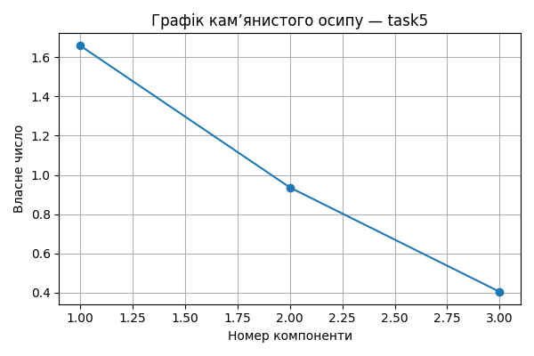

# Практична робота 5 — Метод головних компонент
## Завдання: task5

### 📊 Вхідні дані

```csv
CapitalReturn,AnnualValueOfOVF,LaborProductivity
1.96,45.44,6.22
1.02,41.08,5.49
1.85,136.14,6.5
0.88,42.39,6.61
0.62,37.39,4.32
1.09,101.78,7.37
1.6,47.55,7.02
1.53,32.61,8.25
1.4,103.25,8.15
2.22,38.95,8.72

```
### 📐 Стандартизовані значення

```csv
CapitalReturn,AnnualValueOfOVF,LaborProductivity
1.06,-0.47,-0.48
-0.775,-0.589,-1.023
0.845,2.006,-0.271
-1.048,-0.553,-0.19
-1.556,-0.69,-1.893
-0.638,1.068,0.376
0.357,-0.412,0.115
0.221,-0.82,1.03
-0.033,1.108,0.956
1.568,-0.647,1.38

```
### 🔗 Матриця кореляцій

```csv
,CapitalReturn,AnnualValueOfOVF,LaborProductivity
CapitalReturn,1.0,0.138,0.595
AnnualValueOfOVF,0.138,1.0,0.152
LaborProductivity,0.595,0.152,1.0

```
### 📈 Власні числа

```text
[1.659 0.936 0.405]
```
### 🧮 Матриця факторного відображення (A)

```csv
,F1,F2,F3
CapitalReturn,-0.868,0.215,-0.448
AnnualValueOfOVF,-0.383,-0.924,-0.011
LaborProductivity,-0.872,0.192,0.451

```
### 🧠 Значення головних компонент (F)

```csv
F1,F2,F3
-0.321,0.57,-0.686
1.789,0.181,-0.107
-1.265,-1.722,-0.523
1.287,0.249,0.391
3.264,-0.061,-0.149
-0.183,-1.052,0.444
-0.252,0.48,-0.104
-0.775,1.002,0.375
-1.229,-0.847,0.434
-2.315,1.2,-0.073
```
### 🧩 Інтерпретація головних компонент
- F1: найбільше впливають LaborProductivity, CapitalReturn
- F2: найбільше впливають AnnualValueOfOVF, CapitalReturn
- F3: найбільше впливають LaborProductivity, CapitalReturn


### 📌 Висновки
- Найбільш значущі ознаки мають найбільші вагові коефіцієнти у перших компонентах.
- Сума власних чисел ≈ кількість ознак: пояснення дисперсії повне.
