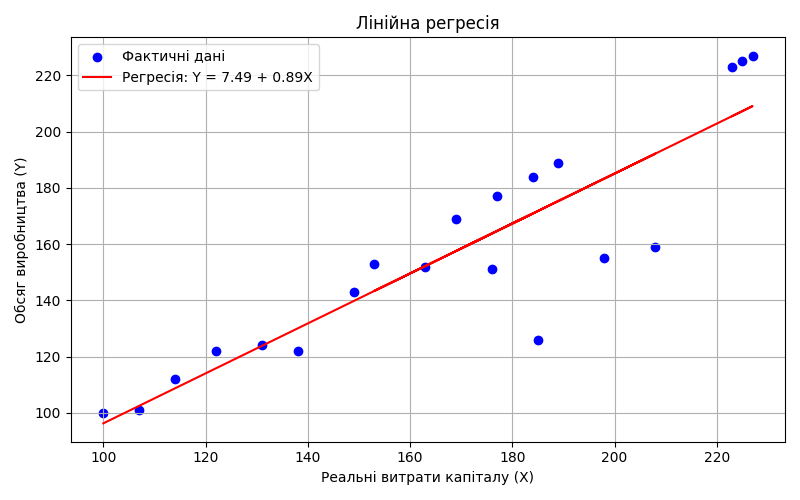
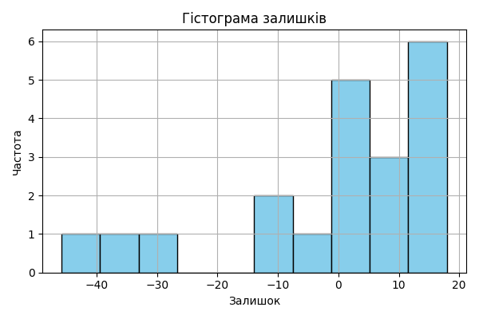
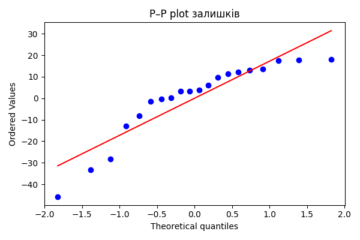

# Практична робота №6 — Регресійний аналіз в лінійних моделях

**Мета:** ознайомитись з властивостями регресійного аналізу і провести регресійний аналіз статистичних даних.

## 📊 Вихідні дані
- Залежна змінна: Y — реальний обсяг виробництва
- Незалежна змінна: X — реальні витрати капіталу
- Кількість спостережень: 20

## 📐 Модель
Побудовано лінійну модель:

\[ Y = 7.493 + 0.888X \]

Коефіцієнт детермінації: \( R^2 = 0.7962 \)

## 📈 Графік регресії

## 📊 Таблиця залишків
Збережено у `results/pr6_residuals.csv`. Містить фактичні значення, прогнозовані та залишки.

## 📉 Гістограма залишків

## 📈 P–P plot залишків

## 📌 Висновок
> Отримана модель демонструє високий ступінь лінійної залежності між витратами капіталу та обсягом виробництва. Гістограма залишків має приблизно симетричну форму, а P–P plot показує, що залишки близькі до нормального розподілу. Це підтверджує адекватність моделі та коректність застосування методу найменших квадратів.
